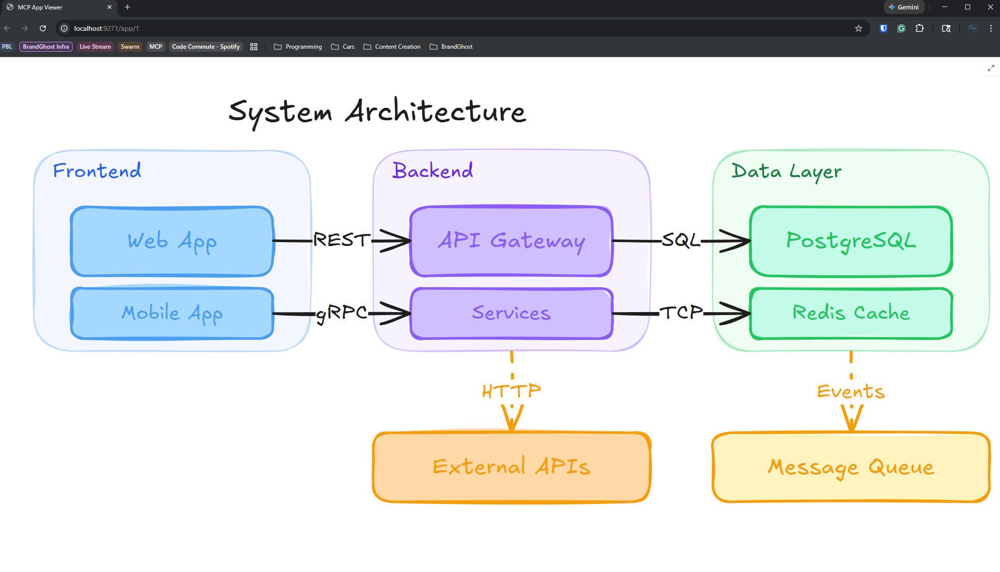

# MCP App Shim

A stdio MCP proxy that bridges CLI-based MCP clients (like [GitHub Copilot CLI](https://docs.github.com/en/copilot)) to [MCP App](https://modelcontextprotocol.io/specification/2025-03-26/server/utilities/apps) servers with interactive browser-based UIs.

Built by [Nick Cosentino](https://www.linktr.ee/devleader) to support development on the [BrandGhost](https://www.brandghost.ai) platform.

## Example

An Excalidraw architecture diagram rendered in the browser via `mcp-app-shim`, triggered from a Copilot CLI tool call:



## The Problem

MCP App servers (like [Excalidraw MCP](https://github.com/excalidraw/excalidraw-mcp)) use `registerAppTool()` to expose tools with interactive HTML widgets. Hosts like Claude Desktop or ChatGPT render these inline. But stdio-based clients like Copilot CLI don't support the MCP Apps UI extension — they only see the text result and silently discard the interactive content.

## The Solution

`mcp-app-shim` sits between your CLI client and the upstream MCP App server:

```
┌──────────────┐   stdio    ┌───────────────┐   HTTP/SSE    ┌──────────────────┐
│  Copilot CLI  │◄─────────►│  mcp-app-shim  │◄────────────►│  MCP App Server  │
│  (or any      │           │                │              │  (Excalidraw,    │
│   MCP client) │           │  ┌──────────┐  │              │   Playground,    │
└──────────────┘           │  │ Browser  │  │              │   custom, etc.)  │
                            │  │ Host     │  │              └──────────────────┘
                            │  └──────────┘  │
                            └───────────────┘
```

1. **Proxies all tools transparently** — standard tools pass through unchanged
2. **Detects app tools** — tools with `_meta.ui.resourceUri` trigger browser rendering
3. **Fetches the HTML resource** from the upstream server
4. **Opens your browser** with the interactive UI, including full AppBridge protocol support (tool input/result delivery, `callServerTool` proxying)
5. **Returns the text result** to your CLI client as normal

## Quick Start

### Prerequisites

- Node.js 18+
- npm

### Install

```bash
git clone https://github.com/ncosentino/mcp-app-shim.git
cd mcp-app-shim
npm install
npm run build
```

### Use with Copilot CLI

Add the shim as a wrapper around any MCP App server in your Copilot CLI config (`~/.copilot/mcp-config.json`):

```json
{
  "servers": {
    "excalidraw": {
      "command": "node",
      "args": [
        "/path/to/mcp-app-shim/dist/index.js",
        "https://mcp.excalidraw.com/mcp"
      ]
    }
  }
}
```

That's it. Now when Copilot CLI calls an Excalidraw tool like `create_view`, the diagram opens in your browser automatically.

### Use with Claude Desktop

Add to your Claude Desktop config (`claude_desktop_config.json`):

```json
{
  "mcpServers": {
    "excalidraw": {
      "command": "node",
      "args": [
        "/path/to/mcp-app-shim/dist/index.js",
        "https://mcp.excalidraw.com/mcp"
      ]
    }
  }
}
```

### Use from the command line

```bash
# Run directly
node dist/index.js https://mcp.excalidraw.com/mcp

# Or if installed globally / via npx
mcp-app-shim https://mcp.excalidraw.com/mcp
```

## Example Integrations

The shim works with any MCP server that uses `registerAppTool()` from `@modelcontextprotocol/ext-apps`. Here are some you can try:

### Excalidraw MCP

Interactive diagramming and whiteboarding. Tools: `create_view`, `export_to_excalidraw`, `save_checkpoint`, `read_checkpoint`.

```json
{
  "excalidraw": {
    "command": "node",
    "args": ["/path/to/mcp-app-shim/dist/index.js", "https://mcp.excalidraw.com/mcp"]
  }
}
```

### MCP Apps Playground

A demo server with interactive tools like drag-and-drop list sorters, flame graph visualizations, and feature flag dashboards.

```json
{
  "playground": {
    "command": "node",
    "args": ["/path/to/mcp-app-shim/dist/index.js", "https://playground.mcpapps.dev/mcp"]
  }
}
```

### Your Own MCP App Server

If you build an MCP server using `registerAppTool()`, you can wrap it with the shim:

```json
{
  "my-app": {
    "command": "node",
    "args": ["/path/to/mcp-app-shim/dist/index.js", "http://localhost:3000/mcp"]
  }
}
```

A minimal MCP App server looks like:

```typescript
import { McpServer } from "@modelcontextprotocol/sdk/server/mcp.js";
import { registerAppTool, registerAppResource } from "@modelcontextprotocol/ext-apps/server";
import { z } from "zod";

const server = new McpServer({ name: "my-app", version: "1.0.0" });

// Register a UI resource (HTML that runs in the browser)
registerAppResource(server, "widget", "ui://my-app/widget", {}, async () => ({
  contents: [{
    uri: "ui://my-app/widget",
    mimeType: "text/html;profile=mcp-app",
    text: `<html><body>
      <h1>My Widget</h1>
      <script type="module">
        import { App } from "https://esm.sh/@modelcontextprotocol/ext-apps";
        const app = new App({ name: "widget", version: "1.0.0" });
        app.ontoolinput = (params) => {
          document.body.innerHTML += "<pre>" + JSON.stringify(params.input) + "</pre>";
        };
        await app.connect();
      </script>
    </body></html>`
  }]
}));

// Register a tool linked to the UI
registerAppTool(server, "show_widget", {
  description: "Show an interactive widget",
  inputSchema: { query: z.string() },
  _meta: { ui: { resourceUri: "ui://my-app/widget" } }
}, async ({ query }) => {
  return { content: [{ type: "text", text: `Query: ${query}` }] };
});
```

## How It Works

### Architecture

The shim runs two local HTTP servers:

- **Host page** (port 9271) — Renders the outer frame, manages WebSocket connection to the shim, implements the [MCP Apps host protocol](https://modelcontextprotocol.io/specification/2025-03-26/server/utilities/apps)
- **Sandbox page** (port 9272) — Different origin for security isolation, loads the app HTML in a nested iframe via `document.write()`

### Protocol Flow

```
1. CLI calls tool          →  shim forwards to upstream server
2. Upstream returns result  →  shim checks for _meta.ui.resourceUri
3. If app tool:
   a. Fetch HTML resource from upstream
   b. Start local host/sandbox servers (if not running)
   c. Serve HTML, open browser
   d. WebSocket pushes tool input + result to browser
   e. AppBridge initializes (ui/initialize handshake)
   f. App renders with full interactivity
4. Text result returned to CLI as normal
```

### AppBridge Support

The host page implements the MCP Apps AppBridge protocol:

- **`ui/initialize`** — Responds with `hostInfo`, `hostCapabilities`, and `hostContext`
- **`tools/call`** — Proxies `callServerTool` requests from the app back through the shim to the upstream server
- **Tool input/result delivery** — Pushes via `ui/notifications/tool-input` and `ui/notifications/tool-result`

## Development

```bash
# Build
npm run build

# Watch mode
npm run dev

# Run integration tests
npx tsx test/integration.ts
```

### Project Structure

```
src/
  index.ts              # Stdio MCP proxy (main entry point)
  app-host-server.ts    # Express servers + WebSocket + HTML host/sandbox pages
test/
  integration.ts        # Full integration test
  test-server.ts        # Mock MCP server with normal + app tools
  test-client.ts        # Direct client connection test
```

## License

MIT

---

Created by [Nick Cosentino](https://www.linktr.ee/devleader) for [BrandGhost](https://www.brandghost.ai) — an AI-powered social media management platform.
